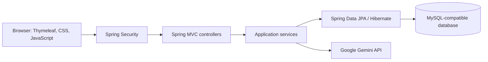

# HotDevJobs

**A full-stack job portal connecting job seekers with recruiters, with AI assistance built into both workflows.**

[Live application](https://job-portal-0lgp.onrender.com/) · [Setup and operations](docs/operations.md)

Built with Java 17 and Spring Boot, HotDevJobs brings job discovery, applications, recruiter job management, and career preparation into a single application.

## Product overview

| Job seekers | Recruiters |
| --- | --- |
| Search by title, location, employment type, workplace, and posting date | Publish and edit job openings |
| Track submitted applications and saved opportunities | Review applicants for their job posts |
| Build a professional profile with skills and a resume | Maintain a company and recruiter profile |
| View application counts and profile completion | View job-post and application counts |
| Generate interview questions and a practice plan | Generate a job-description draft for review |

Both dashboards use responsive layouts with job cards, sorting, filters, and clear empty states. Registration and login use Spring Security, with separate job seeker and recruiter account types.

## AI assistance

The assistant supports two focused tasks: **interview preparation** for job seekers and **job-description drafting** for recruiters.

Requests pass through the Spring Boot backend to Google Gemini. The signed-in user's role determines the task, and only text explicitly entered into the assistant is sent. Profiles, resumes, and application records are not automatically included.

- API credentials stay on the server.
- Requests require consent, enforce input limits, and apply a session-based cooldown.
- Timeouts and provider-error handling keep failures visible and recoverable.
- Generated text is displayed as a draft for human review; it is not automatically published or used to rank applicants.

The rest of the portal works without AI configuration.

## Technical design



| Layer | Technology |
| --- | --- |
| Backend | Java 17, Spring Boot 3.4, Spring MVC |
| Authentication | Spring Security, BCrypt password hashing |
| Persistence | Spring Data JPA, Hibernate, MySQL-compatible database / TiDB Cloud |
| Frontend | Thymeleaf, HTML, CSS, JavaScript, Bootstrap |
| AI | Google Gemini REST API |
| Testing | JUnit 5, Mockito, MockMvc, H2 |
| Build and deployment | Maven, Docker, Render |

The code separates controllers, services, repositories, and entities. Persisted records include creation and update timestamps. A public `/health` endpoint provides a lightweight liveness check without invoking the database or AI provider.

## Run locally

**Prerequisites:** Java 17+, Maven, and a MySQL-compatible database.

Configure these environment variables in your terminal or IDE:

```text
DB_URL=jdbc:mysql://your-host:4000/jobportal?sslMode=VERIFY_IDENTITY
DB_USERNAME=your-username
DB_PASSWORD=your-password
```

To enable the optional assistant, also configure:

```text
GEMINI_API_KEY=your-key
GEMINI_MODEL=gemini-3.5-flash-lite
```

The model is configurable. Obtain a key from [Google AI Studio](https://aistudio.google.com/apikey) and check the provider's current quotas and data-use policy before enabling it for users.

Start the application:

```bash
mvn spring-boot:run
```

Open **http://localhost:8080**. Create a job seeker or recruiter account to explore the corresponding workflow.

For local development, the application also reads `application-secrets.properties` from the project root. This file is excluded from Git and Docker; configure deployment credentials through Render's environment settings.

## Validation

```bash
mvn test
```

The test suite covers application startup, profile schema initialization, authentication redirects, dashboard rendering, recruiter search ownership, applied/saved views, sorting, and the public health endpoint. AI tests cover authorization, consent, input validation, throttling, response parsing, and provider failures using mocked API responses.

Dashboard layouts have also been checked at desktop, tablet, and mobile widths using rendered test fixtures.

## Deployment

The repository includes a multi-stage Docker build and a Render blueprint with `/health` configured as its health-check path. The container runs as a non-root user and accepts the port supplied by Render.

The demo uses Render's free tier, so startup delays can occur after inactivity. Deployment configuration, AI setup, monitoring instructions, and current implementation limits are documented in the [operations guide](docs/operations.md).
