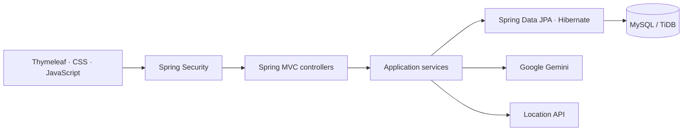

# HotDevJobs

**A full-stack recruitment portal with personalized job discovery, recruiter workflows, and AI-assisted career preparation.**

[Explore the application](https://job-portal-0lgp.onrender.com/)

HotDevJobs brings job seekers and recruiters into one application. Candidates can discover relevant roles, build a professional profile, save opportunities, and apply. Recruiters can publish openings, review applicants, and manage their company profile.

## Core workflows

| Job seekers | Recruiters |
| --- | --- |
| Discover jobs matched to a target role and skills | Publish and edit detailed job postings |
| Search by keyword, company, location, and work arrangement | Review candidates who applied to their openings |
| Save opportunities and track submitted applications | View posting and application counts |
| Maintain skills, experience, preferences, and a resume | Maintain a recruiter and company profile |
| Prepare for interviews with AI-generated practice plans | Draft job descriptions with AI assistance |

## Features

- **Personalized discovery:** profile-based ordering prioritizes relevant roles and uses posting date when no useful match exists.
- **Focused browsing:** 12 jobs per page in public search and the dashboard, with sorting and filters for experience, employment type, workplace, and posting date.
- **Public job details:** visitors can read descriptions and requirements before signing in; applications, saved jobs, and recruiter tools require authentication.
- **Search suggestions:** title and company suggestions come from posted jobs; location suggestions cover cities, states, and countries.
- **Consistent controls:** keyboard-accessible location menus, responsive filters, clear selection states, and country/state/city inputs across profiles and job posting.
- **Complete profiles:** skills, experience, employment preferences, resumes, and recruiter company information.
- **Job management:** rich-text descriptions, ownership checks for editing, candidate review, and saved/applied views.
- **Account verification:** email-code verification with expiry, resend limits, and single-use codes.
- **Responsive design:** dedicated recruiter and job-seeker dashboards with profile completion, activity counts, and clear empty states.

The catalogue includes a clearly identified sample collection spanning 50 roles across India, the UK, the US, and Canada, allowing the search and application workflows to be explored with varied data.

## AI assistance

Google Gemini supports two focused workflows: **job-description drafting** for recruiters and **interview preparation** for candidates.

The backend selects the task from the signed-in user's role. Requests require consent, enforce input limits, and apply a cooldown. Generated content remains a draft for the user to review. Credentials stay on the server, and profiles and resumes are not automatically sent to the AI provider.

Job recommendations use local profile matching rather than AI-generated suitability scores.

## Architecture



Controllers handle requests, services coordinate application behavior, and repositories manage persistence. Entity relationships connect accounts, profiles, companies, locations, job posts, applications, and saved opportunities.

| Area | Technologies |
| --- | --- |
| Backend | Java 17, Spring Boot, Spring MVC |
| Security | Spring Security, BCrypt |
| Persistence | Spring Data JPA, Hibernate, MySQL-compatible database |
| Frontend | Thymeleaf, JavaScript, CSS, Bootstrap |
| AI integration | Google Gemini REST API |
| Tests | JUnit 5, Mockito, MockMvc, H2 |
| Build and delivery | Maven, Docker, Render |

## Quality and validation

Automated tests cover application startup, authentication redirects, recruiter ownership, dashboard rendering, profile validation, pagination, recommendation ordering, search-provider failures, AI request handling, and email verification.

Browser checks cover desktop and mobile layouts, keyboard navigation, location selection, filter controls, and the rich-text editor. The public `/health` endpoint supports service monitoring.

## Getting started

Use Java 17 and a MySQL-compatible database. Follow the [configuration guide](docs/operations.md) for database and integration settings.

```bash
./mvnw spring-boot:run
```

Open `http://localhost:8080`. On Windows, use `mvnw.cmd`.

Run the automated tests:

```bash
./mvnw test
```
